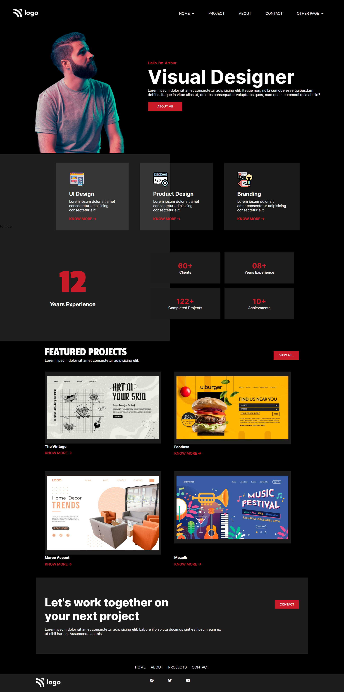

# HTML Project 15
**I Am Abhishek Singh**
> This is my Fiveteen project which is portfolio website of HTML and CSS and it has one page content.

 #

## Project Web page

In this project I explore some of the new concept which is backdrop-filter. That gives glass type background to targeted element.
and the animation which is most fascinating we can create our animation just my typing `@keyframes` after that give animation an identifier(or name) and start writing code in it like => *at what percent of time what you want in your animation*  for full clarity visit [style](style.css) css file .

#

### Duration Of Completing this project
> Honestly it took me more than **5 hours** .

[Visit This Project Live](https://abhi-project-1.netlify.app/)

#

To see my work visit my [Portfolio]("my-portfolio-website")

